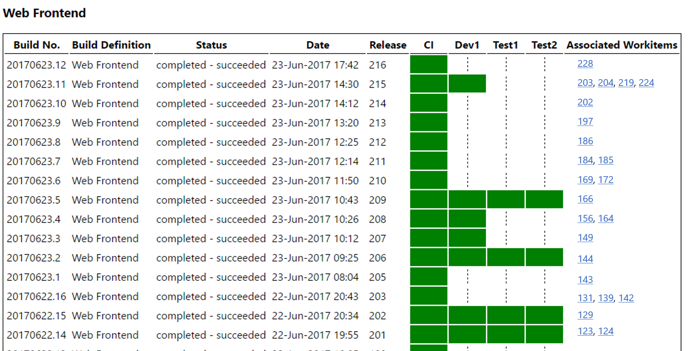

# VSTS-Release-Report
VSTS Hub Extension to report on cumulative work items associated with builds and releases.

## Problem
In VSTS, Releases are linked to the Builds from which they are created.  Builds are in-turn linked to Changesets which are linked to Work Items that describe the nature of the changes being made in the changeset.  When you create a Release there is a section the defines the assoicated work items.  This can be emailed as a Release Note from the Release view.

In practice however not every build is deployed to an envrionment.  You may have 4 or 5 builds in DEV before you decided to release to TEST.  The Release you create for TEST however only references the latest build and not all the builds since the last release to TEST.  This makes it difficult for the teams to know what Work Items are 'new' in a particular envrionment.

## VSTS Release Report
The VSTS Release Report links these two aspects togther to give a consolodated view of each build, where it has been released and the Work Items associated with each Build.

An user of a particular environment can see when a build was last deployed and the aggregation of work items between each deployment.

## About This Project
This is open source as a good example of a [**VSTS Extension**](https://www.visualstudio.com/en-us/docs/integrate/extensions/overview) and as an example of using the new [**VSTS REST APIs**](https://www.visualstudio.com/en-us/docs/integrate/api/overview).

### Explaining the Code

*Authentication*.  The process to use OAUTH exists but its a little complicate for this example.  Perhaps oneday I'll get to it but for now the extensions uses basic authentication and a VSTS Personal Access token (PAT) to authenticate requests to the API.  PATs are created as part of your account (click on your profile image > Security).  The PAT is btoa encoded and attached to the HTTP request header.

*Token Security*.  When you first open the extension it will check for a token in collection storage.  If one is not found it will ask you to enter one.  When you save this token it is saved in the secure collection account on VSTS together with your email address.  When the extension is opened by someone we check their email address against this setting and if it is you we allow you to view and update the token.  If it isn't you, you can't do anything.  The first person to hit the extension will get to set the token using their OWN PAT.  So yes, OAUTH would be better.

*API Client*.  We did not use the API Client and the services (the one under VSS.Init) since that doens't have access to Releases.  The Release Management features in VSTS are slightly different having been aquired and sit under a different URL.  This is likely why the client doesn't have access.  So to avoid the pain of using two different techniques and the fact that the REST APIs are much easier to code against, we went for those.

*Client Framework*.  We're using AngularJS on the frontend.  Yeah, yeah there are others.  I used this and it works .. just .. fine.

*Mapping Process*.  Time for some Pseudo-Code!

* Ensure we have the token.  If not, do some dancing to get it.  Once we do, all the good stuff is in the leadVstsData function
* Set the Auth header using the token
* We're going to be doing some manual mapping on the envrionments so we initialize that dictionary first.  Note : we're assuming build definitions within a particular project will use the same envrionments.  Not always true but true enough to assume it for this release.
* Getting data and building the object model
    * Get all the Build Definitions and store in scope
    * Get all the Builds and store in scope <- likely going to get slower the more we have so some filtering would be useful here.
    * We transfer the build definition name from the object back to the root.  This is due to me not being able to user a angularJS filter on a deep property.  I gave it 20 mins then moved on.
    * Get all the Releases > note here this is a slightly different URL of [account].vsrm.visualstudio.com ... if you try against [account].visualstudio.com then you may be scratching your head for a few mins (or longer).
    * The Release objects returned from /release/releases don't provide all the data we need for work items so we loop these and replace them with direct responses from /release/releases/[id] > perhaps there is a better way 
    * Copy the Build Definition name and the Build ID that the release is linked to back to the root (same reason as before)
    * Loop though each build obtained in the step at the start and attach the matching release to the root.  This makes the rendering a little easier but probably a little more processing that strictly required.
    * We make the last call to get the Work Items associated with a release and link it back to the release object as an array.  Note here another assumption that we create a release with EVERY build.  Hence we can use the WIs linked to the releases just as we can linked to the builds.  This is usually the case if you've implemented Continuous Integration (CI) and Continuous Delviery (CI).  If you havn't then you should ...
    * Lastly we process the envrionment info on the release (the reason we needed the full object).  We build up the dictionary of Envrionments and record the status for that release.
* Rednering the object model
    * The work we did to build an easy object model make rendering a little easier.  We use a simple table.
    * Repeat for each Build Definition
        * Create a table
        * Write a row for each build including the linked release id
        * Loop though all the envrionments in the dictionary and obtain the status for that envrionment from the envData dictionary attached to the release object.
            * If there was a successful release mark it thus.  
            * If not draw a funky line thing that draws the eye down to the previous successful release in that envrionment
        * Loop out all the work items

### TODOs

* PBI : Link to all the artifacts with hyperlinks (build, release, build definition)
* PBI : Better Auth process.  Remove the need to setup a PAT.
* PBI : More diverse testing including more failed build and release scenarios
* BUG : Showing double work items on some envrionments - deduplication needed
* PBI : Get a proper UI designer to make it nice
* PBI : Put a limit on the number of items returned from the API.  We really only need to go back as far as the previous deployment so we can get the aggregated view
* PBI : Email Microsoft and tell them to get Builds and Releases as Work Items so we can stop all this messin around
* PBI : Email Microsoft to get this kind of aggretation view built into the platform
* PBI : Reenvision this solution as a Dashboard Widget
* BUG : Fix all the typos that there are likely to be in this document ;-)

